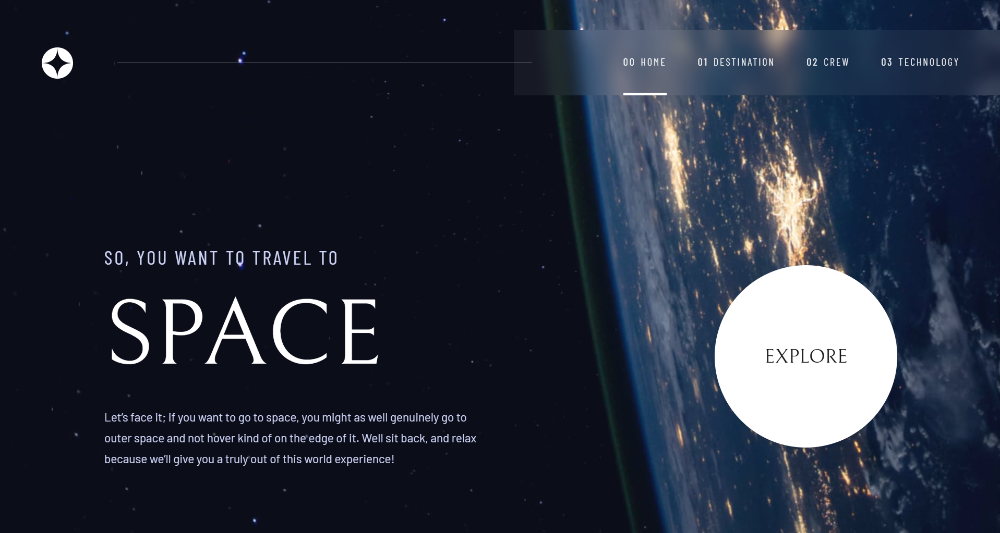

# Frontend Mentor - Space tourism website solution

This is a solution to the [Space tourism website challenge on Frontend Mentor](https://www.frontendmentor.io/challenges/space-tourism-multipage-website-gRWj1URZ3). Frontend Mentor challenges help you improve your coding skills by building realistic projects.

## Table of contents

- [Overview](#overview)
  - [The challenge](#the-challenge)
  - [Screenshot](#screenshot)
  - [Links](#links)
- [My process](#my-process)
  - [Built with](#built-with)
  - [What I learned](#what-i-learned)
  - [Continued development](#continued-development)
  - [AI Collaboration](#ai-collaboration)
- [Author](#author)

**Note: Delete this note and update the table of contents based on what sections you keep.**

## Overview

### The challenge

Users should be able to:

- View the optimal layout for each of the website's pages depending on their device's screen size
- See hover states for all interactive elements on the page
- View each page and be able to toggle between the tabs to see new information

### Screenshot

### Links

- Solution URL: 
- Live Site URL: 

## My process

### Built with

- Semantic HTML5 markup
- CSS custom properties
- Flexbox
- CSS Grid
- Mobile-first workflow
- [React](https://reactjs.org/)
- [Tailwind](https://tailwindcss.com/)
- [Motion](https://motion.dev/)

### What I learned

I kinda treated this as a test run for properly deploying stuff, minus buying the domain and deploying on vercel, which are relatively simple, i obviously aside from trying to get as close a match to the original as possible tried to more focus on other stuff, like selfhosting fonts to improve performance, adding a very little bit of SEO, and generally trying to replicate what it would be like to make an actual fully fledged website

### Continued development

Im gonna keep doing the stuff i mentioned before, since it improves lighthouse scores drastically

### AI Collaboration

Not gonna pretend i didnt use AI, i needed help a little help selfhosting fonts, and what to add where for that slight SEO, but its kinda the stuff you learn once and do over and over, aswell as the horizontal scroll on desktop, i just couldnt get it working fully for some reason. I used claude as always.

## Author

- Frontend Mentor - [@denissoboslai13](https://www.frontendmentor.io/profile/denissoboslai13)
- Twitter - [@yourusername](https://www.twitter.com/yourusername)
